# DB_lab2
Лабораторная работа №2: 
-------------------------
1. Придумать свою предметную область и продумать схему БД для неё. 
2. Реализовать реляционную БД для своей предметной области(все таблицы должны быть не менее чем в третьей нормальной форме) 
3. Критерии к БД: 
   1. БД должна быть в третьей нормальной форме или выше; 
   2. Минимальное количество таблиц – 2; 
   3. Все подключения из GUI должны осуществляться выделенным, не root, пользователем; 
   4. Должен существовать как минимум один индекс, созданный вами по выбранному текстовому не ключевому полю; 
   5. В одной из таблиц должно присутствовать поле, заполняемое/изменяемое только триггером (например, «общая стоимость бронирования» в таблице «бронирования», которое   автоматически высчитывается при добавлении/изменении/удалении билетов, входящих в это бронирование) 
4. Реализовать программу GUI со следующим функционалом: 
   1. Создание базы данных (важно(!) именно create database, а не только create table) 
   2. Удаление базы данных 
   3. Вывод содержимого таблиц 
   4. Очистка(частичная - одной, и полная - всех) таблиц 
   5. Добавление новых данных 
   6. Поиск по заранее выбранному (вами) текстовому не ключевому полю 
   7. Обновление кортежа 
   8. Удаление по заранее выбранному текстовому не ключевому полю 
   9. Удаление конкретной записи, выбранной пользователем 
   10. Все функции должны быть реализованы как хранимые процедуры.  

Из GUI вызывать только хранимые процедуры/функции. Выполнение произвольного SQL кода запрещено.  
В качестве отчёта от вас ожидается: описание вашей предметной области, схема бд(с пояснением в какой НФ она находится и почему), исходный код(лучше всего выкладывайте на любой source control server, например github, bitbucket и мне просто ссылку) и демонстрация работы вашего приложения на практике в виде видео с комментариями 

Выполнение:
------------
1. Наша база данных это онлайн магазин.
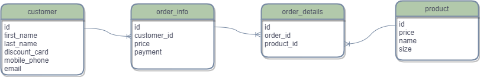

* 1НФ: все атрибуты бд являются простыми, все используемые домены должны содержать только скалярные значения. Не должно быть повторений строк в таблице.
* 2НФ: бд находится в 1НФ и каждый не ключевой атрибут неприводимо зависит от Первичного Ключа(ПК).
* 3НФ: бд находится в 3НФ, когда находится во 2НФ и каждый не ключевой атрибут нетранзитивно зависит от первичного ключа.

Создадим пользователя:
```SQL
CREATE USER 'olesya_tanya'@'localhost' IDENTIFIED BY 'databases_are_the_best';
```
Дадим все привелегии:
```SQL
GRANT ALL PRIVILEGES ON * . * TO 'olesya_tanya'@'localhost';
```
Далее создадим базуданных online shop:
```SQL
CREATE DATABASE online_shop DEFAULT CHARACTER SET utf8 DEFAULT COLLATE utf8_general_ci;
```
И все таблицы:
```SQL
CREATE TABLE customer (
   id INT UNSIGNED NOT NULL AUTO_INCREMENT,
   first_name VARCHAR(255) NOT NULL,
   last_name VARCHAR(255) NOT NULL, 
   discount_card INT UNSIGNED NOT NULL,
   mobile_phone INT UNSIGNED NOT NULL,
   email VARCHAR(255) NOT NULL,
   PRIMARY KEY (id)
);

CREATE TABLE order_info (
   id INT UNSIGNED NOT NULL AUTO_INCREMENT,
   customer_id INT UNSIGNED NOT NULL,
   price FLOAT UNSIGNED,
   payment ENUM('credit_card', 'cash') NOT NULL,
   PRIMARY KEY (id)
);

CREATE TABLE product(
   id INT UNSIGNED NOT NULL AUTO_INCREMENT,
   price FLOAT UNSIGNED NOT NULL,
   name VARCHAR(255) NOT NULL,
   size ENUM('XS', 'S', 'M', 'L', 'XL') NOT NULL,
   PRIMARY KEY (id)
);

CREATE TABLE order_details (
   id INT UNSIGNED NOT NULL AUTO_INCREMENT,
   order_id INT UNSIGNED NOT NULL,
   product_id INT UNSIGNED NOT NULL,
   PRIMARY KEY (id),
   CONSTRAINT order_info
   FOREIGN KEY (order_id) REFERENCES customer (id)
   ON UPDATE RESTRICT
   ON DELETE RESTRICT,
   CONSTRAINT order_product
   FOREIGN KEY (product_id) REFERENCES product (id)
   ON UPDATE RESTRICT
   ON DELETE RESTRICT
);
```
Создадим индекс:
```sql
CREATE INDEX index_email ON customer (email);
```
Добавим триггеры:
```sql
delimiter |

CREATE TRIGGER order_insert AFTER INSERT ON order_details
  FOR EACH ROW
  BEGIN
    UPDATE order_info SET price = price + (SELECT price FROM product WHERE NEW.product_id = product.id AND NEW.order_id = order_info.id);
  END;
|

delimiter ;


delimiter |

CREATE TRIGGER order_delete AFTER DELETE ON order_details
  FOR EACH ROW
  BEGIN
    UPDATE order_info SET price = price - (SELECT price FROM product WHERE OLD.product_id = product.id AND OLD.order_id = order_info.id);
  END;
|

delimiter ;
```

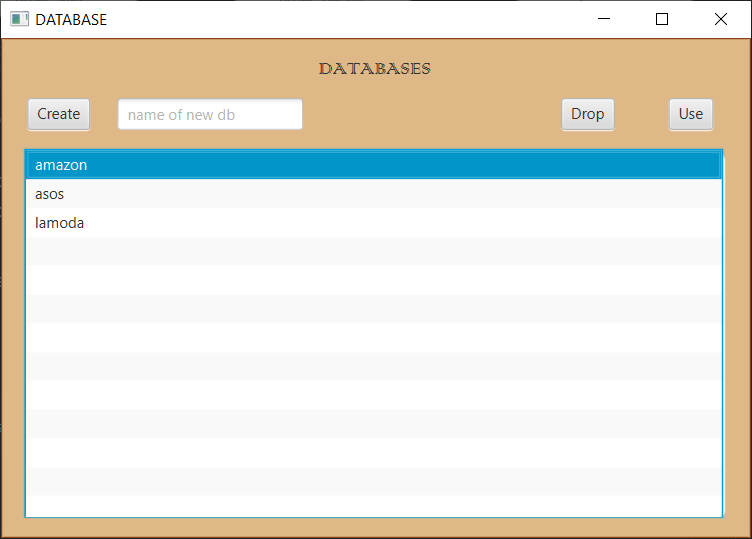
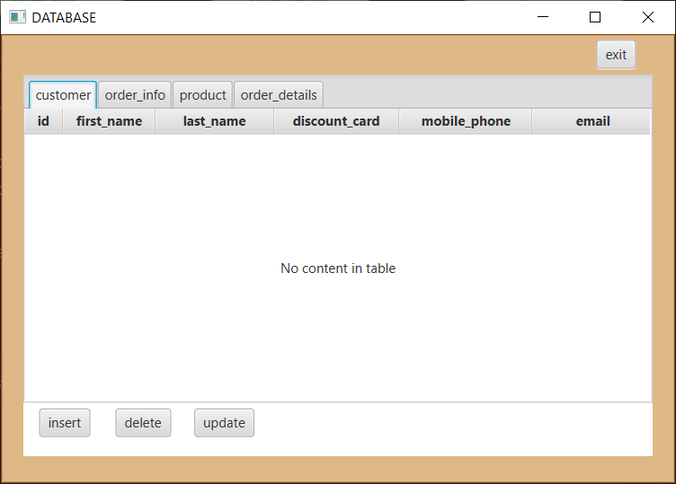
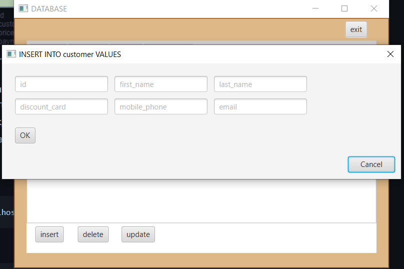
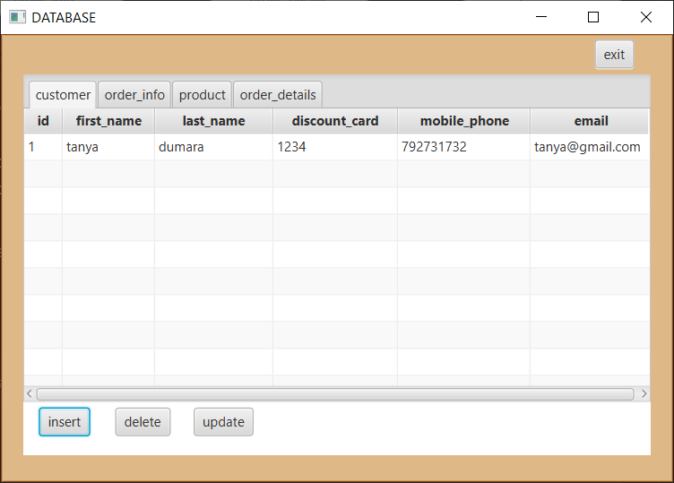
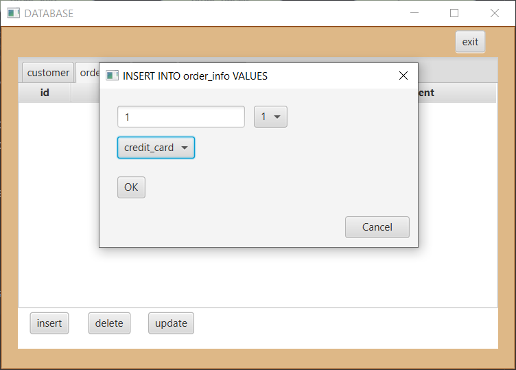
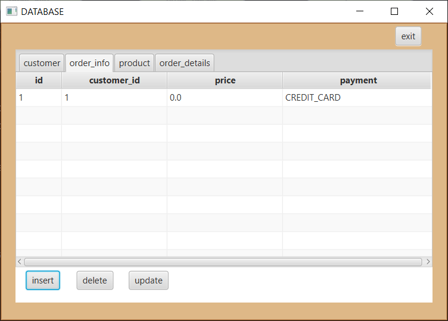
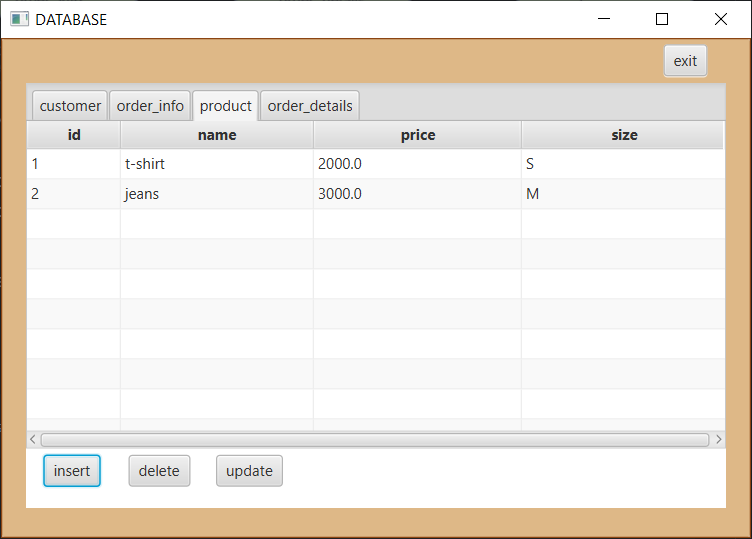
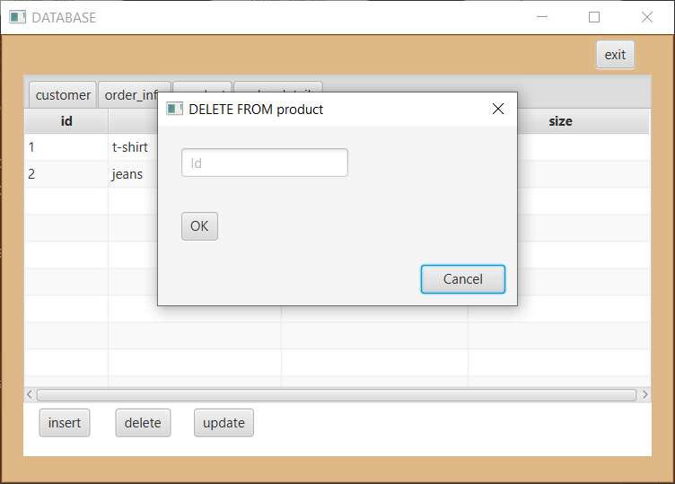
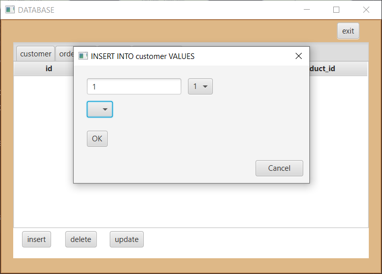
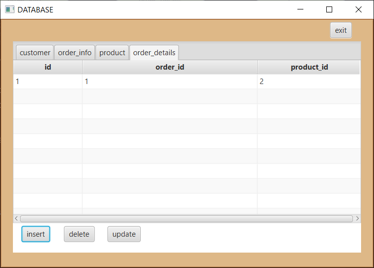
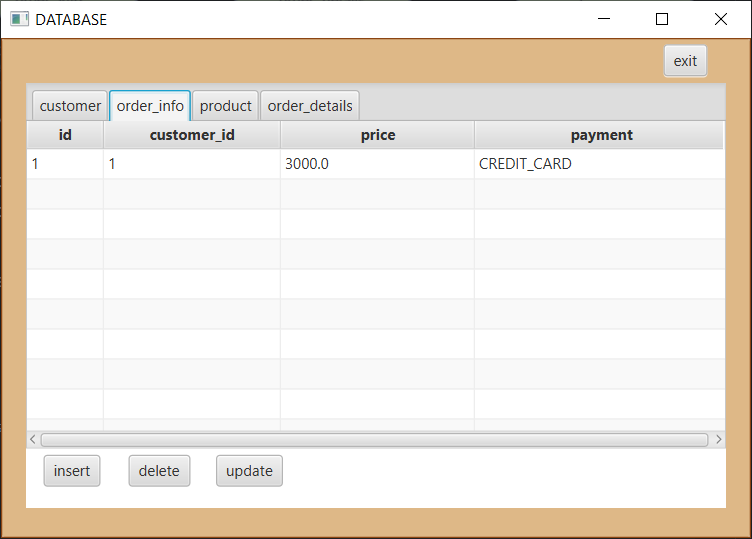
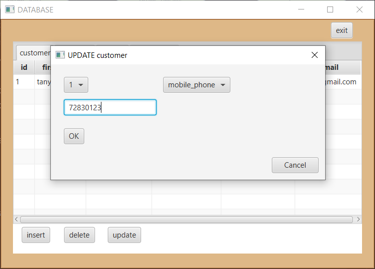
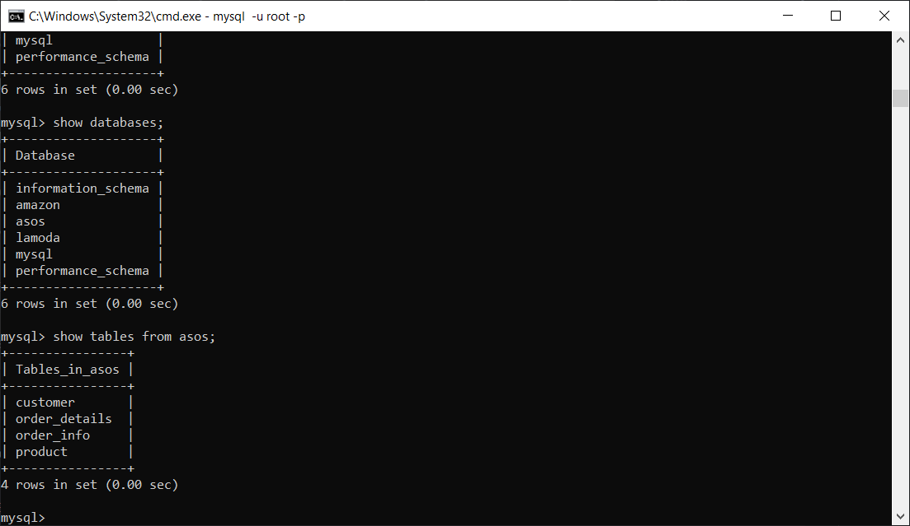
